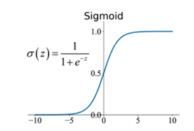

## Machine Learning
- 많은 AI분야 중의 한 분야이다.
- Data를 통해 배우고, manual instructions을 최소화하고 예측값을 추론
- 통계적 알고리즘에 의존
- Supervised learning과 Unsupervised learning으로 나뉨
  - Supervised learning: 정답이 있음
  - Unsupervised learning: 정답이 없음

## Supervised Learning Framework
- STEP 1: 모델의 형태를 디자인하기
- STEP 2: 모델의 목적을 정의하기
- STEP 3: 학습된 데이터로 최적의 parameter를 찾기
- STEP 4: 학습하지 않았던 입력값을 주고 결과값 측정하기

## Regression Function
- x를 input으로 받아 y를 output으로 출력하는 함수
- f(x)를 찾는 것이 목적이 아닌, x를 가지고 y예측을 잘하는 f(x)를 찾는 것이 목표
- 좋은 Regression Function은 어떤 x가 y에 관련 있는지, 없는지를 잘 파악함
- 데이터에서 여러 값이 하나의 x에 있는 경우 좋은 값은 평균값이다.

## Parametric model
- 유한한 갯수의 parameter를 통해 그 관계를 학습하는 모델
- Ex) Linear regression 등
- 입력값들과 파라미터의 선형 결합으로 예측을 수행함
- 현실의 데이터들이 모두 linear model에 맞진 않지만 해석이 쉬움

## Non - parametric methods
- 함수의 형태에 대해 명시적인 가정을 하지 않음
- 데이터를 가능한 잘 따르는 함수 f(x)를 찾는 것이 목적
- 모델 형식이 틀릴 위험이 없음
- 매우 많은 수의 데이터가 필요
- Ex) K-NN, Decison Tree 등

## Regression function의 목적
- 입력 x가 주어졌을 때 y가 예측함수와 최대한 가까워야 한다는 것이 목적
- 보통 조건부 기대값을 f(x)로 사용
- 예측 오차를 제곱해서 평균을 낸 값(MSE)을 최소화 하려면 조건부 기대값을 사용 해야함

## Optimization
- Loss function이나 error를 최소화하는 파라미터를 찾는 것
- Linear regression에서는 MSE를 최소화함
- Good Optimization은 Good predictive performance와 연관됨

## Good fit vs Over-fit or Under-fit
- Good fit: 학습 데이터에 잘 맞는 모델
- Over-fit: 너무 학습데이터에 맞춰서 새로운 데이터에 성능이 떨어짐
- Under-fit: 학습데이터조차 잘 설명하지 못함

## Prediction accuracy vs Interpretability
- Prediction accuracy: Non-linear model이나 Deep learning모델은 정확도가 높음
- But 해석이 어려움
- Interpretability: Linear model은 해석하기가 쉬움
- But 정확도가 비교적 낮음

## Parsimony vs Complexity
- Parsimony: 변수가 적고 구조를 단순히 함
- Complexity: 변수가 많고 구조를 어렵게 함
- 간단하고 해석이 쉬운 모델일 수록 오버피팅을 방지하고 비용이 싼 경향이 있음

## Linear Regression에서 인자 명칭
- 가정한 모델: \\(y = \beta_0 + \beta_1 x + \varepsilon\\)
- \\(\beta_0\\): intercept, coefficients라고 부름
- \\(\beta_1\\): slope, parameter라고 부름
- \\(\varepsilon\\): error
  
## Linear Regression Model의 정확도 평가
- RSS(Residual sum of squares)
  - (실제값 - 예측값)의 제곱의 합
  - 0에 가까울수록 정확함
- RSE(Residual standard error)
  - RSS를 n-2로 나눈 후 루트를 씌움
  - 0에 가까울수록 정확함
- R-squared
  -  \\( \frac{TSS(분산) - RSS}{TSS} = 1 - \frac{RSS}{TSS} \\)
  - RSS가 0이면 값이 1로 나오며 정확한 상태
  - RSS가 커져서 분산에 가까워지면 가장 부정확한 상태
- 각 인자는 상관관계가 있는 것이지 인과관계가 있는 것이 아님

## 왜 Least Squares를 쓰는가?
- Independent and Identically Distributed(I.I.D) 가정
  - 각 데이터는 서로 독립임
  - 모든 데이터는 같은 확률 분포에서 나옴
- 먼저 Maximum likelihood estimator(MLE)를 알아야함
  - 우리가 원하는 θ값을 찾을 때 사용
  - 데이터가 주어졌을 때 특정 데이터가 나타날 확률의 곱(IID가정이라 독립임) = Likelihood
  - 여기서 Likelihood Function을 최대화 하는 θ를 찾는것이 MLE임
  - 계산의 편의를 위해 log스케일로 사용
- 결론적으로 수학적으로 계산이 간단하고 통계적으로 정당하며, 실제로도 잘 작동하기 때문

## Linear Regression에서 Qualitative predictors는 어떻게 계산하는가
- 회귀모형에서 사용하려면 숫자로 변환해야함
- 이 상황에서 쓰는 것이 더미변수(dummy variables)임
- n개의 데이터에서 n-1개의 더미변수를 만들어야함
- 나머지 하나는 baseline으로 설정되기 때문에 n-1

## Interaction
- 여러가지 변수들은 서로 상호작용을함
- 해당 상호작용도 회귀식에 반영할 수 있음
- 2가지의 인자면 두 변수의 곱을 식에 반영하면 됨
- Hierachy
  - 2가지의 변수를 하는 경우 혼자 쓰이는 경우를 먼저 계산해야함
  - 그 이후 서로의 상호작용을 반영해야함
  - 당연하게도 독립적으로 영향을 미치는 부분이 훨씬 크기 때문임

## Nonlinear relationship
- Interaction에서 두 변수의 곱을 식에 반영하는 방식으로 2차 이상식도 반영이 가능
- 같은 변수가 두번 이상 곱해지면 됨
- 해당 변수의 파라미터가 양수면 시너지관계

## Least square은 항상 존재하는가?
- 그렇지 않음, 해당 값을 계산할때 역행렬이 들어가는데, 역행렬이 존재하지 않을 수 있음

## Best subset selection
- 가능한 모든 조합을 비교하여 가장 최적의 식을 찾는 것
- 매우 큰 데이터의 경우 지수스케일로 복잡도가 커지는 단점이 있음
- 차원이 커질수록 필요로하는 변수가 지수스케일로 커지기에 curse of dimensionality가 발생
- 오버피팅이 발생할 수 있음

## Stepwise selection(forward)
- 변수가 없는 상태에서 성능향상이 가장 큰 변수부터 추가
- 모든 조합을 계산하지 않는 장점이 있음
- best solution이 보장되지 않음

## Stepwise selection(backward)
- 모든 변수가 들어간 식에서 기여도가 가장 작은 변수를 제거하며 가장 최적의 식을 찾는 방법
- 데이터의 갯수 n이 변수의 갯수 p보다 항상 커야만 가능

## Stagewise selection
- 초기 식에 변수를 추가할 때 앞선 식을 상수로 취급하여 그대로 가져감
- 추후 파라미터가 업데이트 될 수 있음

## 어떻게 최적의 모델을 찾는가?
- 변수를 모두 포함하는 것이 무조건적으로 최적의 식을 도출할 것임
- 하지만 성능계산은 training data가 아니라, 반드시 test data로 해야함 
- 랜덤하게 10~20%를 test data로 빼둬야함
- Validation: training data중에서 test로 쓸 부분
- K-fold cross validation
  - 전체 데이터를 k로 나누어 각 부분을 test data로 쓰는 것
  - k번의 교차검증을 하는 것임
  - 편향성을 없앨 수 있음

## Regression vs Classification
- Regression: 수치값을 찾는 것
  - ex) 시험 점수: 87점
- Classification: 범주를 찾는 것
  - ex) 시험 등급: B등

## Sigmoid Function
- \\(\sigma(z) = \frac{1}{1 + e^{-z}}\\)
- 확률로 해석이 가능하기에 classification에서 씀
- 경계를 설정해 줄 수 있음
- 
- 출처: https://rgbitcode.com/blog/senspond/55

## Logistic Regression
- 주어진 변수를 바탕으로 결과값을 예측하는 모델
- Linear regression처럼 계산하고 sigmoid에 넣어 확률로 변환
- 특정 경계값을 정하여 그 이상이면 1 아니면 0
- 식이 non-linear하기에 파라미터가 closed form이 아님 -> 수식으로 못품
- 따라서, Optimization을 사용하여 근사적으로 구함

## Gradient Descent
- 손실함수의 최소값을 구하기 위해 해당 함수의 기울기를 따라 조금씩 이동하는 방법
- \\(\theta \leftarrow \theta - \alpha \cdot \nabla J(\theta)\\)
- \\(\theta\\): 모델의 파라미터(진행에 따라 업데이트 됨)
- \\(\alpha\\): 학습률 (learning rate)
- \\(\nabla J(\theta)\\): 손실 함수 \( J(\theta) \)에 대한 기울기
- 손실함수가 convex할때 global minimum을 보장함
- 하지만 대부분 non-convex하기에 local minumum 혹은 saddle point가 존재함
- 손실함수가 미분 가능할때만 작동 가능
- 데이터가 매우 많으면 학습 시간이 매우 길어짐

## Overfitting
- 모델이 traing data에 너무 과하게 접학하여 test data에 대해 적합하지 못하는 현상
- 모델구조가 너무 복잡해지면 오버피팅이 발생함
- training data가 너무 적으면 발생함
- noise까지 학습하면 발생함
- 그 결과로 training data에 대한 성능은 좋음
- 하지만 test data에 대한 성능이 나쁨

## Regularization
- 앞선 오버피팅을 방지하기위해 모델을 규제하는 방법
- 기존 손실함수에 regularization term을 추가함
  - regularization term: \\(\lambda\\) * Penalty
- 여기서 penalty의 종류에 따라 ridge와 lasso로 나뉨

## Ridge Regression(L2 정규화)
- 모델의 모든 파라미터를 작게 만듬
- 파라미터를 0으로 만들지는 않음
- 오버피팅을 줄이지만 모든 변수는 남음
- 각 파라미터를 작게 만들어 복잡도를 낮춤

## Lasso Regression(L1 정규화)
- 파라미터 일부를 아예 0으로 만듬
- 불필요한 파라미터를 제거 가능함
- 모델 해석이 쉬움
- 고차원 데이터에서 유용함
- 중요하지 않은 파라미터를 제거해서 모델을 단순하게 만듬

## Bias-Variance Trade-off
- High Bias and Low Variance
  - 단순 모델
  - 오버피팅 확률 낮음
  - Ex) linear regression
- Low Bias and Hugh Variance
  - 복잡 모델
  - 오버피팅 확률 높음
  - Ex) 고차 다항 회귀

## Decision Tree
- 데이터를 특정 조건에 따라 분할하며 예측하는 모델
- 쉽게 해석이 가능하고 트리구조로 설명이 쉬움

## Regression Tree
- 연속적인 값을 어떠한 방식으로 구분해야 하는지 찾는 모델
- greedy: 당장 선택할 조건만 보는 식
- 나누어진 구간의 평균값을 대표값으로 사용
- 분할기준: MSE가 최소가 되도록 분할함
  
## Classification Tree
- 범주형 값을 어떠한 방식으로 구분해야 하는지 찾는 모델
- 나누어진 구간에서 갯수가 가장 많은 값을 대표값으로 사용
- 분할기준: gini impurity, entropy를 사용

## Pruning(가지치기)
- 오버피팅된 트리구조에서 특정 가지를 잘라내는 과정
- Pre-pruning
  - 트리를 만드는 도중에 더 이상 나누지 않도록 멈추는 방식
  - 빠르고 간단함
  - 너무 일찍 멈추면 underfitting 가능성이 있음
- Post-pruning
  - 트리를 다 만들고 가지를 잘라내는 방식
  - 더욱 세밀하게 가지치기 가능
  - 구현이 복잡하고 시간이 오래걸림

## Bootstrapping
- 한정된 데이터를 복원추출로 여러번 샘플링해서 모델에 학습시키는 기법
- 데이터 부족을 극복할 수 있음
- 분산이 감소함
- overfitting 방지 효과

## Bagging(Bootstrap Aggregating)
- 여러개의 bootstrapped 데이터셋을 만듬
- 각 데이터셋으로 독립적인 모델을 학습시킴
- 예측 시에는 각 모델의 결과를 모아서 종합함
  - 회귀방식 -> 평균을 사용
  - 분류방식 -> 다수결을 사용
- overfitting을 방지함
- 분산이 감소함 -> 일반화 향상
- 예측 안정성 향상

## Random Forest
- 여러개의 Decision Trees를 만들어 각 트리의 예측 결과를 결합하는 모델
- 각 트리에서 분할 기준을 선택할 때 무작위하게 선택
- 정확도가 높음
- overfitting방지
- 해석이 어려움

## Boosting
- 여러개의 weak learner를 순차적으로 학습시키며 오류를 보완하는 앙상블 기법
- AdaBoosting
  - 이전에 틀린 문제의 가중치를 높이고
  - 이전에 맞은 문제의 가중치를 낮추는 방식
 
## SVM(Support Vector Machine)
- 데이터를 두 클래스로 나누는 최적의 경계선(Hyperplane)을찾는 지도학습 알고리즘
- 용어정리
  - Margin: Hyperplane에서 가장 가까운 데이터까지의 거리
  - Support Vector: Margin을 결장하는 핵심 데이터
- Margin이 가장 넓은 선을 찾는 것이 목표 -> optimal hyperplane을 찾기
- 현실 데이터는 대부분 직선으로 완벽히 나누어지지 않음 -> 확장의 필요성
  - soft margin: 약간의 노이즈를 허용 -> C라는 하이퍼파라미터를 사용
    - C가 크면 오차 적게 허용 -> overfitting 위험
    - C가 작으면 오차 많이 허용 -> 일반성 높아짐
  - kernel trick: 데이터의 차원을 높여서 해결

## Margin-based Loss function
- Margin이란 예측의 확신도를 수치로 표현한 값 -> Margin = \\(y \hat{y}\\)
  - \\(y \in \ {+1, -1\}\\): 실제 정답
  - \\(\hat{y}\\): 예측값
  - Margin이 +1에 가까우면 예측도 강하고 정답률도 높음
  - Margin이 -1에 가까우면 예측은 강하지만 정답률이 낮음
- Hinge Loss : max(0,1-\\(y \hat{y}\\))
  - SVM에서 사용하는 함수
  - Margin이 1보다 잡으면 loss가 존재하고 1이상이면 loss가 0임
    - 즉 정답일지라도 margin이 충분히 크지 않으면 패널티를 줌
  - 확신있는 예측을 하도록 학습을 유도함
- Log Loss(Logistic Loss): \\( \log(1 + e^{-y \hat{y}}) \\)
  - Logistic Regression에서 사용하는 함수
  - Margin이 커질수록 로그스케일로 감소
  - 확률적 해석이 가능함
- Exponential Loss: \\(e^{-y \hat{y}}\\)
  - Boosting 계열에서 사용
  - margin이 작아질수록 지수적으로 큰 패널티
  - 오분류를 강하게 억제하지만 overfitting의 위험이 있음

## Clustering
- 비슷한 데이터끼리 묶는 비지도학습
- lable(정답)이 없는 상태에서 패턴이나 구조를 자동으로 발견
- inner similarity는 최대화, inter similarity는 최소화
- Ex) K-means, Hierarchical clustering 등

## K-means
- 데이터를 K개의 클러스터로 나누는 알고리즘
- K를 선택
- 초기 중심점을 랜덤하게 설정
- 각 데이터를 가까운 중심점에 할당
- 각 클러스터의 평균값으로 중심점을 갱신
- 해당 과정 반복(변화가 없을 때까지)
- 유한한 데이터는 유한한 조합이 있기에 반드시 종료됨
- 초기 중심점에 따라 결과가 달라짐
- 최적의 K를 선택하는 방법으로 elbow-point가 있음

## Dimension Reduction
- 고차원 데이터를 낮은 차원으로 변환하는 기법
- Data Manifold
  - 데이터는 고차원에 있지만 실제로는 더 낮은 차원(manifold)에 깔려 있음
  - 이러한 data manifold를 저차원 공간으로 펼치는 것이 Dimension Reduction의 목적임
- MDS(Multidimensional Scaling)
  - 고차원 데이터의 점들 간 거리를 저차원에서도 최대한 유지하는 방식
  - 모든 데이터간의 유클리드 거리행렬을 계산
  - 그 거리를 최대한 보존하며 저차원에 매핑
- PCA(Principal Component Analysis)
  - 데이터의 분산을 최대한 보존하는 방향으로 축을 찾아 회전시켜 매핑하는 방식
  - 전체에서 분산이 가장 큰 방향을 찾음
  - 그에 수직인 방향에 두 번째로 큰 축을 찾음
  - n차원 데이터를 k차원(축으로 정한 갯수)으로 투영

## Nearest Neighbors
- 새로운 데이터가 주어졌을 때 가장 가까운 기존데이터와 비교해서 예측하는 알고리즘
- 가장 가까운 k개의 이웃을 찾고 다수결로 분류
- 거리 측정 방식은 유클리드 거리, 맨하탄 거리, 코사인 유사도 등도 가능함
- 학습시간: 빠름
- 예측시간: 느림 -> 전부 비교해야함
- 간단하고 직관적임
- 차원의 저주를 극복 못함

## Linear Classifiers(image기준)
- 이미지 데이터는 원래 2D배열임 이를 1D벡터로 펼침(flatten)
- 각 클래스별 가중치 벡터를 곱하여 해당 값을 출력으로 가짐
- 출력값을 시그모이드에 넣어 0~1로 압축 -> 확률처럼 해석 가능
- 클래스가 여러개일 경우 시그모이드가 아닌 softmax를 사용함

## Cross Entropy
- 예측값과 레이블(정답) 사이의 차이를 계산하는 손실함수
- Softmax + Cross Entropy는 classifier 문제의 표준 조합임

## KL Divergence(Kullback-Leibler Divergence)
- Cross Entropy는 예측값과 정답을 비교하지만
- KL Divergence은 두 확률 분포간의 유사도를 측정함

---
---
Deep Learning
---
## Perceptron
- 인공신경망의 기본 단위
- 입력값들에 가중치를 곱한 선형조합을 activation function에 대입하여 출력을 냄
- bias도 포함됨
- 여러개의 Perceptron을 사용하면 Multiple Perceptron임
  - 다차원 문제를 해결 가능

## Neural network
- Perceptron을 여러층으로 연결한 구조
- 입력층, 은닉층(Hidden layer), 출력층으로 구성됨
- 비선형적인 문제도 해결 가능
- 주로 Backpropagation을 통해 이루어짐

## Single layer
- 입력층과 출력층만 있는 신경망 구조
- XOR 문제를 해결하지 못함

## Multilayer Perceptron
- 입력층과 출력층 뿐만 아니라 은닉층도 가짐
- 비선형 activation function을 사용함
- 학습은 Backpropagation와 경사하강법을 이용함

## Activation function
- 퍼셉트론에 들어온 선형조합을 비선형 함수로 바꿔주어 복잡한 문제를 해결해줌
- Step function: 0 or 1
- Sigmoid
- tanh(x)
- ReLu: max(0, x)

## Backpropagation
- 출력값과 정답사이의 오차를 바탕으로 가중치를 업데이트하기 위한 gradient를 계산하는 알고리즘
- forward pass 계산
- loss 계산
- 역방향으로 chain rule을 이용해 gradient계산
- 각 가중치를 경사 하강법으로 업데이트
- upstream gredient를 받아 local gradient를 곱하여 downstream gradient로 나감

## Chain Rule
- 복합함수의 미분을 계산할때 사용하는 미분 규칙
- \\(\frac{dz}{dx} = \frac{dz}{dy} \cdot \frac{dy}{dx}\\)

## Fully Connected Layer
- 모든 입력값이 모든 출력값에 연결된 신경망구조
- 파라미터 수가 많음
- spatial structure를 고려하지 않음

## Spatial Locality
- 데이터에서 서로 가까운 픽셀들이 관련있는 정보를 가질 가능성이 높은 성질
- CNN의 핵심가정 중 하나

## Positional Invariance
- 이미지내에 위치가 바뀌어도 동일하게 인식할 수 있는 능력
- CNN의 핵심가정 중 하나

## Convolutional Layer
- 입력이미지에 필터를 적용해 feature map을 생성하는 층
- 필터를 입력이미지에 convolve하여 값을 계산
- 이미지의 특정 패턴을 감지

## Nested Convolutional Layer
- 여러개의 conv layer를 쌓은 구조
- 저수준(처음): 모서리, 선 등 감지
- 중간수준: 윤곽, 패턴 등 감지
- 고수준(끝): 객체 감지
- 깊을수록 어려운 학습 가능

## Stride
- 필터가 입력이미지를 읽는 간격
- 값이 크면 계산량 감소, 정보 손실

## Padding
- 필터로 읽으면 출력값이 입력값보다 작아짐(1x1필터 제외)
- 따라서 테두리부분을 0으로 패딩을 함
- 출력값이 작아지지 않음

## Pooling layer
- feature map을 압축하여 중요한 정보만 추출하는 층
- Ex) 2x2를 1x1로 줄임(max값만 추출)
- 오버피팅을 방지함
- Positional Invariance 증가

## Sigmoid's problem
- kill gradient: backpropagation시 거의 0이 나오면 문제가 됨
- not zero-centered output: gredient update가 항상 양수거나 음수만 됨

## Tanh funtion's problem
- kill gradient: backpropagation시 거의 0이 나오면 문제가 됨
- tanh(x) = 2*sig(2x)-1

## ReLu's problem
- not zero-centered output
- 0에서 미분 불가능
- 처음에 음수나오면 이후 계속 음

## Leaky ReLU
- max(0.01x, x)
- 0이하가 0으로 죽는 경우를 방지함
- 여전히 0에서 미분 불가능
  
## ELU
- \\(x(if x>=0)\\)
- \\(\alpha \cdot (e^x - 1)(if x<0)\\)
- 0에서 미분이 가능
- exp는 여전히 계산이 비쌈

## Data Augmentation
- 기존의 데이터를 변형하거나 확장하여 학습 데이터를 늘리는 기법
- 데이터가 부족하거나 모델이 overfitting 되는 것을 방지
- Ex) 상하반전, 회전, 이동, 노이즈추가, 잘라내기, 색상변화

## Weight Initializing
- 가중치가 너무 작으면 gradient가 소실됨
- 가중치가 너무 높으면 gradient가 폭주함
- 이러한 경우 backpropagation가 힘들어짐
- Xavier Initialization
  - activate funtion이 linear하거나 sigmoid나 tanh 일 때 적절한 가중치를 제공
  - \\( d_{\text{in}} \\)으로 나눠줌 -> \\( d_{\text{in}} \\)는 입력 차원 수

## Learning rate
- very high: 에폭에 따라 로스가 매우 커짐
- low: 학습속도가 느림 -> 에폭에 따라 로스가 서서히 내려감
- high: 초반에 로스가 빨리 내려가나, 이후 플랫한 형태가 나옴
- 따라서 초반에 높게 설정 후 서서히 낮춤 = Learning rate decay
  - Cosine 방식
  - Linear 방식
  - Inverse Sqrt 방식
- Initial Warmup
  - 초기 구간의 학습률을 0에서 선형적으로 증가시키고 이후 정해진 방식대로 감소

## DL에서 overfitting 줄이는 방법
- Dropout: 각각의 forward pass에서 랜덤하게 몇몇 뉴런을 0으로 바꾸기
  - training과정에서 50%확률로 뉴런을 끄면서 최적화 시키고 test에선 다 켜기
  - training과정에서 뉴런이 꺼졌던 것을 보정하기 위해 출력값에 scale을 적용
  - Ex) 출력을 0.5배로 줄여서 일관성 유지
- Batch normalization
- Data augmentation

## SGD(Stochastic Gradient Descent)
- Jittering: loss함수가 한 방향으로 가파르고 다른방향으로 완만할 떄, SGD가 가파른 방향으로 심하게 튕기며 수렴 속도가 느려지는 현상
- Saddle points: 말 안장처럼 어느 방향에서든 gradient가 0이 되는 부분에 SGD가 고립되는 문제점
- Inaccurate gradient estimation: 전체 데이터가 아닌 일부(mini-batch)만 보고 gradient를 계산하기에, 부정확할 수 있음

## 해결법
- Momentum: 이전의 속도를 반영하여 이후 위치계산에 반영하는 것
  - Jittering을 줄이기 좋음
  - 수렴 속도 빠름
- Adagrad: 자주 업데이트된 파라미터는 학습률을 줄이고 드물게 업데이트된 파라미터는 학습률을 키움
  - NLP등 에서 매우 유리
  - 제곱누적합이 계속 커지고 분모로 들어가서 학습률이 0으로 수렴할 수 있음
- RMSProp: Adagrad의 제곱 누적합 대신 EMA를 사용함 -> 최근 계산에 집중
  - 학습률이 0으로 수렴하지 않음
- Adam: Momentum + RMSProp
  - 거의 모든 문제에 기본값처럼 많이 사용함
  - 빠르고 안정적

## Optimization
- First Optimization: 1차함수로 접선을 그어서 찾음
  - 빠르고 여러번 할 수 있음
- Second Optimization: 2차함수로 접선을 그어서 찾음
  - 느리지만 조금만 해도 찾을 수 있음
 
## Batch Normalization
- 학습 중에 각 층의 입력 분포가 계속 바뀌면 다음 층이 그 변화에 계속 적응해야해서 학습이 느려짐
- ex)기압과 온도는 다름
- 각층의 입력을 정규화해주는 것이 Batch Normalization
- 한 층의 입력을 mini-batch 단위로 정규화
- 정규화과정에서 분산이 0이 될수 있으므로 입실론 추가
- 일반적으로 Activate function 전에 사용
- Test에는 전제 배치가 없기 때문에 training에 사용된 데이터를 사용해야함
- IID가정이 필수적임, batch크기가 너무 작으면 문제가 생김

## Word Embedding
- 단어들을 벡터화 하는 것
- 관련성이 높은 단어끼리는 벡터상 가깝게
- Word2Vec
  - 주변 단어들로부터 타겟 단어를 예측
  - 타겟 단어로부터 주변 단어들을 예측
- GloVe(Global Vectors)
  - 해당 단어가 특정 단어와 동시출현할 확률을 계산
  - 이를 벡터화하여 의미적 관계가 잘 보존된 벡터를 얻게 됨

## RNN(Recurrent Neural Networks)
- GloVe를 통해 단어를 벡터화하고 함수로 넣어 함수를 여러번 반복하여 결과값을 출력하는 매커니즘
- Many-to-one
  - Sentiment Analysis
    - CNN을 쓰자니, 입력값을 정해야해서 불가능 -> text를 처리할 땐 입력값을 정해주기 힘듬
    - 그래서 Encoder라는 것을 사용함 -> 각 단어를 벡터화해서 Encoder에 넣고 그로부터 Sentence vector를 출력하도록 함
- One-to-one
  - 하나를 입력받아 가중치를 반영하고
  - 그 반영된 결과값에 또 다른 입력을 받아 새로운 결과값을 도출
  - 반복
  - 결과값 도출
  - 이 과정에서 각 가중치(\\( W_{\text{??}} \\))는 항상 같아야함 -> 몇 개가 입력될지 모르니까
    - 입력값(x)을 함수로 넣을때의 가중치 = \\( W_{\text{xh}} \\)
    - 함수의 입력값에 반영될 가중치 = \\( W_{\text{hh}} \\)
    - 최종 결과값과 비교할때 반영할 가중치 = \\( W_{\text{hy}} \\)
- Many-to-many
  - 다음 단어예측을 매 과정마다 해주는 것
  - loss함수는 Cross-entropy를 사용함
  - 몇몇의 backpropagation은 중첩되어야함 -> 앞선 예측을 재귀적으로 반복하니까
- Multilayer RNN
  - 앞선 Many-to-many를 여러층으로 만듬
- RNN의 장점
  - input의 길이가 상관이 없다
  - 매 step마다 같은 가중치를 사용한다
  - model의 size가 일정함
- RNN의 단점
  - 재귀적인 과정이 매우 느림
  - training과정에서 vanishing gradient가 발생함
  - 긴문장에서 앞선 내용을 잘 기억하지 못함

## n-gram
- 문장의 확률을 계산할 때 앞의 n-1개의 단어를 보고 현재 단어의 확률을 계산
- 매우 정확하지만 계산이 너무 복잡하고 데이터가 부족함
- 그래서 Markov Assumption이 필요함
  - Markov Assumption: 현재 단어는 과거 모든 단어가 아닌 바로 앞에 등장한 n-1개의 단어만에 의존한다고 단순화 하는 가정
- 이것이 바로 n-gram
- n이 커질수록 더 많은 문맥을 반영하여 성능이 좋아짐
- 하지만 메모리 사용량이 기하급수적으로 증가
- 단어들의 조합은 경우의 수가 너무 많아져 엄청난 데이터가 필요함

## Gradient Flow problem in RNN
- backpropagation과정에서 gradient가 누적이 됨
- \\( \frac{\partial \mathcal{L}_t}{\partial h_t} \left( \prod_{k=2}^{t} \tanh'\left( \mathbf{W}_{hh} \mathbf{h}_{k-1} + \mathbf{W}_{xh} \mathbf{x}_k \right) \right) \mathbf{W}_{hh}^{t-1} \frac{\partial \mathbf{h}_1}{\partial \mathbf{W}_{hh}} \\)
- 해당 식에서 괄호 안의 식은 항상 0~1 사이의 값이 반복해서 곱해짐(tanh'은 항상 0~1값만 가지니)
- \\( W_{\text{hh}} \\)가 t-1번 곱해지는 경우는 발산할 수도 있고 0으로 수렴할 수도 있음
- 먼저 발산하는 경우는 gradient clip을 통해 조절해 줄 수 있음 -> 벡터값의 크기로 나눠주므로 방향은 올바르게 유지가 되고 크기만 조절이 됨
- 하지만 여전히 수렴하는 문제는 해결이 불가능함

## LSTM(Long Short-Term Memory)
- 정보를 장기적으로 보존하거나 버릴 수 있는 Cell State를 도입하는 방식으로 RNN의 문제를 해결
- Cell State는 FC layer가 아닌 highway를 통과하기에 gradient 소실이 적음 -> 장기기억 가능
- Forget gate
  - 새로운 FC에 sigmoid를 결합하여 Cell State에 곱함
  - 기존 계산값(tanh를 통과한 값)에 해당 값을 더함
  - 그 값을 다시 tanh에 넣어 출력함
  - 들어오는 값에 따라 새로 추가된 FC에 가중치를 바꾸어주면 이전 정보를 선택적으로 기억가능
- Input gate
  - 새로운 FC에 sigmoid를 결합하여 기존 계산값(tanh를 통과한 값)에 곱함
  - Cell State의 값을 더함
  - 그 값을 다시 tanh에 넣어 출력함
  - 들어오는 값에 다라 long term memory에 얼마나 반영할지 선택 가능
- Output gate
  - 새로운 FC에 sigmoid를 결합하여 최종 결과값에 곱함
 
## GRU(Gated Recurrent Unit)
- Cell State를 추가하지 않음
- LSTM보다 파라미터 수가 적음
- convex combination(내분)을 사용하여 gradient highway를 hidden state에 추가함
- 기억 상실을 보완하는 게이트 기반 구조

## Machine Translation Problem(seq2seq)
- 다른 언어로 번역하는 일은 어순과 문법의 차이로 1:1 매칭이 되지 않음
- 따라서 앞서 배운 1:1 many-to-many 방법을 사용할 수 없음
- 실제 번역가들이 하는 것 처럼 전체 문장을 Encoding 한 이후 Decoding하는 방법을 사용함
- Encoding이 끝나면 전체 맥락을 저장한 벡터를 만들고 해당 백터를 Decoding의 첫과정으로 넣음
- Decoding의 첫 과정에서 이전 맥락 벡터와 SOS(Start Of Sentence)를 입력값으로 넣고
- 출력값을 하나씩 뽑아냄 -> 이 출력값이 다음 decoding과정의 입력값으로 들어감(Auto-Regressive)
- 학습시킬 때는 정답이 되는 단어들과 Cross-Entropy를 통해 loss를 생성함
- Decoding 과정에서 첫 단어가 잘못된 단어가 나오면 이후로도 계속 헛소리가 나오게됨
- 따라서 첫 단어는 정답을 제출해줘야함 -> Teacher Forcing

## Attention
- Seq2seq는 여전히 오래된 내용을 여전히 기억 못하는 문제점들이 있음
- 따라서 decoding과정에서 encoding때 썼던 벡터들을 활용하자는 아이디어가 생김
- Attention은 그 중 어떤 벡터를 활용할지를 정하는 매커니즘임
- 먼저 Query(현재 상태, Decoder hidden state)와 Key(Encoder hidden state)간의 유사도를 weight로 잡음
- 이후 각각의 key에 weight을 dot-product(내적)하여 Softmax에 넣음
- 해당 값들을 각 key에 반영하여 weighted sum을 만듬 -> Attention value
- 이 값을 Query에 붙이고 FC, activate function 과정을 거쳐 new query로 decoding 진행

## Trasformer
- 앞선 Attention의 query, key, value를 사용함
- 여러개의 입력값이 들어오면 하나의 입력값에 \\( W_{\text{Q}} \\)를 곱하여 하나의 query를 만들어냄
- 이후 모든 입력값에 \\( W_{\text{K}} \\)를 곱하여 여러개의 key를 만들어냄
- 이전에 만든 \\( W_{\text{Q}} \\)와 \\( W_{\text{K}} \\)를 내적하여 softmax에 넣어 각 확률을 구함
- 모든 입력값에 \\( W_{\text{V}} \\)를 곱하여 value를 만들어 이전에 도출된 확률을 곱하여 합함
- 이후 \\( W_{\text{O}} \\)를 곱하여 입력값의 크기와 같은 결과값을 만들어냄
- 이렇게 만들어진 결과는 하나의 입력값과 매우 유사하지만 다른 맥락까지 포함하고 있음
- 이 과정이 transformer임
- 결국 입력값에 매우 유사하지만 모든 맥락을 담고 있는 결과값을 만들어 내는 것임

## Token Aggregation
- Transformer는 self-attention을 통해 입력된 각 토큰의 중요도를 학습함
- 하지만 각 토큰의 중요도를 학습하는것이지 전체 내용을 요약하는 벡터가 존재하지 않음
- 따라서 이를 해결하기위해 CLS라는 더미토큰을 추가함
- 더미토큰에서 나오게된 결과값은 전체 토큰 문맥을 학습하게 됨
- 그 결과값을 classifier에 넣고 학습하게 되면 전체 내용을 반영하는 classifier를 만들수 있음

## Transformer 작동 원리(with 번역)
- 먼저 입력값으로 문장을 받고 각 단어를 word embedding함(GloVe 등)
- RNN의 경우 순차적으로 입력이 들어오기 때문에 토큰의 순서를 반영할 수 있음
- 하지만 Transformer의 경우 병렬적으로 처리하기 때문에 순서정보가 없음
- 그 순서 정보를 더해주는 방법이 Positional encoding임
- 해당 과정을 거치면 같은 단어라도 위치가 다르면 다르게 입력이 되기에 모델이 순서를 인식 할 수 있음
- 이후 각 토큰들의 query, key, value를 attention과 같이 만들어냄
- 문맥에 따라 같은 단어가 나타내는 의미가 다를 수 있으므로 Multi-head self-attention을 사용함
- 여러개의 attention head를 병렬로 사용하여 다양한 관점에서 토큰을 바라보게 해줌
- 각 토큰은 다른 토큰들과의 관계를 반영하기에 토큰끼리 의존적임
- 자기 자신의 벡터값만을 가지고 계산하는 Feed-Foreward Layer를 추가하여 독립적으로 처리를 해줌
- decoder는 incoder의 출력을 입력받음
- 이전에 생선된 토큰 다음 토큰을 생성할 때 예측하는 방식으로 사용함
- decoder는 미래 토큰을 보면 안되기에 mask처리를 함
- 이후 decoder로부터 나온 query, encoder로부터 나온 key, value를 다시 multi-head attention에 넣음
- 이 과정을 반복하고 마지막에 softmax처리를 하여 결과값을 예측함

## BERT
- 입력으로 두 문장을 받고 이를 표현할 떄 3가지 embedding을 부여함
- 단어별로 구분하는 토큰embedding, 문장별로 구분하는 segment embedding, 위치정보를 알려주는 position embedding
- 이후 문장속 일부 단어를 지우고 MASK로 교체 후 정답 단어를 예측하도록 훈련
- 이후 다음 문장이 실제로 이어지는 문장인지 분류하는 문제로 학습시킴

## ViT(Vision Transformer)
- Transformer를 이미지에 직접 적용한 구조임
- 입력된 이미지를 작은 크기의 패치로 나눔
- 각각의 패치를 위의 토큰처럼 여기고 Transformer에 입력
- 기존 NLP와 마찬가지로 CLS토큰을 맨 앞에 추가함 -> 이미지 분류용
- Position embedding을 더해 순서(위치) 정보를 추가
- ViT는 매우 큰 데이터셋에서만 좋은 성능을 냄
- 충분히 학습되면 CNN보다 좋은 성능을 냄
- 작은 데이터셋은 성능이 좋지 못함
