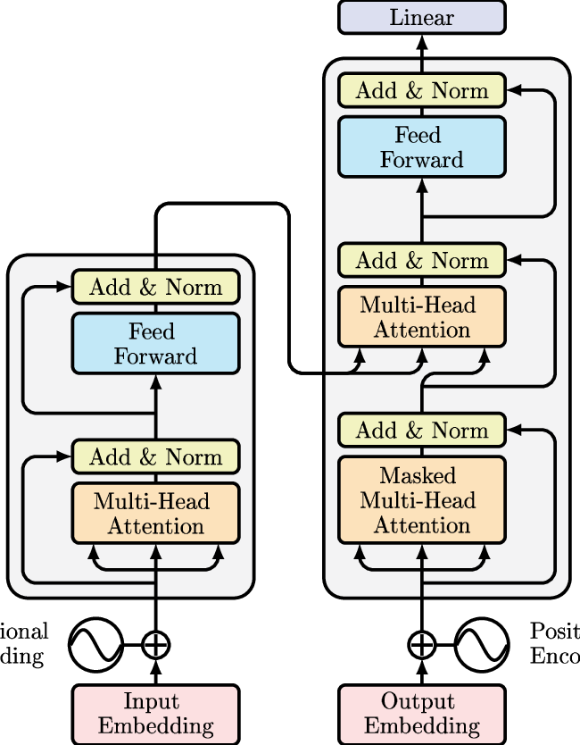

# Transformer에 대한 이해(with 언어)
---

## 인공지능은 어떤 방식으로 언어를 이해할까?

- GPT를 보면 인공지능이 마치 언어를 완벽히 이해한 것처럼 보입니다.
  긴 내용을 주면 요약도 할 수 있고, 영어로 된 글을 줘도 번역을 하고, 새로운 이야기를 창작까지 합니다.
  이런 일들이 가능한 이유는 바로 **Transformer**라는 모델 덕분입니다.

- 2017년 구글은
  **“Attention is All You Need”**라는 논문을 발표했습니다.
  해당 내용은 이전까지 NLP에 사용되어온 RNN 계열을 완전히 대체할
  Transformer를 소개하였습니다.

---

## 2. 기존 모델(RNN/LSTM)의 한계점

- NLP에서는 입력 문장이 순차적인 데이터를 이루기 때문에 각 단어(토큰)의 위치정보도 기억해야하고 순서도 중요합니다.
- 따라서 자연스럽게 **RNN**이나 **LSTM** 같은 모델이 사용됐습니다.
- 이 모델들은 단어를 하나씩 입력받고, 이전 상태의 기억을 활용해 다음 단어를 예측하거나 문장을 처리했습니다.
- 하지만, 이 접근 방식은 여러가지 문제점이 있었습니다.

| 한계 | 설명 |
|------|------|
| 느린 학습률 | 단어를 한 번에 하나씩 처리 |
| 기억력 문제 | 앞에 나왔던 단어를 뒤까지 기억하기 어려움 |
| 정보의 손실 | 구조가 길어질수록 중요한 정보가 사라짐 |
| 복잡한 구조 | 순환 연결 등으로 구현이 복잡함 |

- 특히나 두 단어 사이의 관계라 멀리 떨어져 있는 경우 문제가 발생합니다.
- *The book that I borrowed from the library last week was fascinating.*
- 여기서 명사와 동사는 문장의 시작과 끝에 위치하지만, 의미상 밀접하게 연결되어 있습니다.  
- 기존 모델은 이처럼 멀리 떨어진 단어 간의 관계를 잘 포착하지 못했습니다.

---

## Transformer는 무엇이 다른가?

- Transformer는 이 모든 한계를 한번에 극복한 모델입니다.
- 기존 모델과의 큰 차이점은 크게 2가지입니다.
  - 문장 전체와 상호작용: 한 단어가 나머지 모든 단어와의 상호작용을 통해 중요도를 계산합니다.
  - 병렬적 처리: 이전에 순차적으로 처리하던 문제를 벗어나 한번에 여러 단어를 처리합니다.

- 핵심적인 아이디어는 Self-Attention입니다.
- 이 구조는 각 단어가 문장 내의 모든 다른 단어들에 집중하여 그 중요도를 계산합니다.
- 예를 들어, 문장: *She poured water into the glass because it was empty.*  
- 여기서 "it"이 가리키는 것은 "glass"입니다.  
- Transformer는 "it"과 "glass" 사이의 의미적 연관성을 **수학적으로 계산**하여 높은 점수를 부여합니다.
- 이 과정에 쓰이는 매커니즘이 Self-Attention 입니다.

---

## Transformer의 구조
- Transformer는 Encoder와 Decoder라는 두 가지 블록으로 구성되어 있습니다.  
- 하지만 GPT처럼 디코더만 사용하는 구조도 있고, BERT처럼 인코더만 사용하는 구조도 있습니다.

- 출처: https://www.researchgate.net/figure/Figura-3-Arquitectura-del-Transformador-introducida-en-Attention-is-all-you-need-4_fig1_368664665

#### Encoder 구조

- 먼저 Input Embedding에서 입력 문장의 각 단어를 특정 크기의 벡터로 변환합니다.
- 이 과정에서 순서를 고려하지 않기 때문에 단어의 위치 정보를 벡터에 더해주는 과정이 Positional Encoding입니다.
- 이후 Self-Attention을 여러개 동시에 수행하여 다양한 관점에서 단어 간 관계를 파악하는 과정을 거칩니다.
- 이 과정이 바로 Multi-Head Attention입니다.
- 이렇게 나오게 된 Attention 결과를 입력에 더하여 Layer Normalization을 통해 학습 안정화를 시킵니다. => 정규화
- 추가적으로 각 단어를 작은 신경망에 통과시켜 non-linear 변환을 합니다. => Feed Forward
- 이 과정을 통해 더 복잡한 표현을 만들고 추상화가 됩니다.
- 해당 과정을 여러번 반복합니다.

#### Decoder 구조

- Output Embedding에서 Encoder와 마찬가지로 출력문장도 벡터로 바꾸고 위치정보를 더합니다. => Positional Encoding
- Decoder는 이전 단어까지만 보며 다음 단어를 예측해야 하므로, 미래 단어를 못 보게 가립니다. => Masking
- 마찬가지로 Attention 결과를 입력에 더하여 Layer Normalization을 통해 학습 안정화를 시킵니다.
- 이후 Encoder의 출력과 Decoder의 입력을 연결하여 입력문장과 번역 문장 간 관계를 학습합니다.
- Encoder와 마찬가지로 non-linear 변환을 진행하고 정규화합니다.
- 마지막으로 softmax에 넣어 단어 확률 분표로 변환하여 다음 단어 예측에 사용합니다.

---

## Transformer의 시각적 이해

- https://www.youtube.com/shorts/bGjJpVB4wlg
- 위 영상에서 보듯이, 특정 단어는 자신과 의미적으로 관련된 다른 단어들에 집중하고 있습니다.  
   이러한 구조 덕분에, 문장의 맥락과 의미를 깊이 있게 파악할 수 있습니다.

---

## Transformer의 장점

| 장점 | 설명 |
|------|------|
| 병렬 처리 가능 | 한 번에 모든 단어 처리, 빠른 연산 |
| 전체적 문맥 파악 | 문장 전체를 한눈에 보고 의미 분석 |
| 정보 손실 해결 | 멀리 떨어진 단어 간의 관계도 잘 파악함 |
| 다양한 응용 | 번역, 요약, QA, 생성 등 대부분의 NLP 수행에서 사용 |
| 모듈화된 구조 | 다른 분야(이미지, 음성 등)로도 확장 가능 |

---

## 마무리
- Transformer는 자연어처리뿐 아니라, 컴퓨터 비전, 음성 인식, 생물정보학 등 다양한 분야에 영향을 주고 있는 인공지능 구조입니다.  
- 이 모델이 등장함으로써, 우리는 단어 간의 복잡한 의미 관계를 더 정확하게 포착할 수 있게 되었고, GPT-4 같은 강력한 언어 모델도 탄생하게 되었죠.
- 이러한 Transformer를 이해한다는 것은, 인공지능시대의 출발점이라고 생각합니다.
